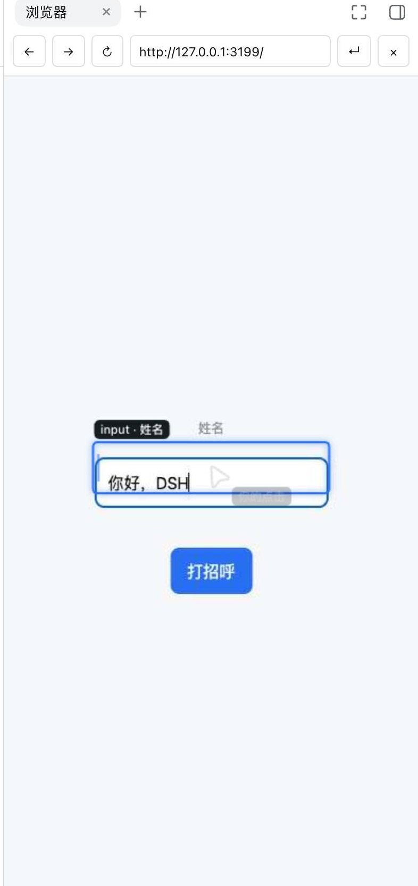

# DSH Browser Plugin

`dsh-plugin-browser` provides a Session-isolated Chromium browser for the DeepSeek Harness Web app, with the same page rendered in the right Sidebar:

- The `browser` tool runs Playwright Chromium in a Session-scoped context for automation, accessibility snapshots, and screenshots.
- The `Browser` page in the Web right Sidebar uses the official Sidebar extension API to stream that same page live and forward pointer, keyboard, navigation, and scroll input.
- The stream carries operation cues: Agent actions leave a mouse pointer with a caption, hovering outlines the element with its role and name, a focused field shows an outline and caret, and typed text echoes briefly.
- The page reflows to the Sidebar's own size. Click, drag, scroll, double-click to select, paste, use an IME, and press Tab, arrows, or paging keys directly on the frame.

The tool and Sidebar share cookies, storage, login state, and page history. Host automation remains headless by default while the Sidebar provides the visible surface. Enter passwords and MFA codes manually in the Sidebar; the tool never exports credentials.

## Feature screenshot



Figure: validation capture of a local fixture page inside the DSH Web right Sidebar, showing the focus outline, element caption, typed-text echo, and mouse pointer; see [`docs/screenshots/SOURCES.md`](docs/screenshots/SOURCES.md) for provenance and validation boundaries.

## Install

Node.js 22.19 or later and Chromium runtime dependencies are required. Use the same `DSH_HOME` when installing and starting Harness.

```sh
git clone https://github.com/hzxwonder-dsh-plugins/dsh-plugin-browser.git
cd dsh-plugin-browser
npm ci
npm run browser:install
dsh plugin --profile migration add "file:$PWD"
```

Keep the `file:` prefix so pnpm installs the package's declared dependencies. A
bare path is treated as `link:` and only links the plugin directory.

Restart Harness after changing the plugin configuration. Host automation is headless by default; an existing Chrome binary can be selected:

```yaml
- id: dsh-plugin-browser
  config:
    executablePath: /Applications/Google Chrome.app/Contents/MacOS/Google Chrome
    headless: true
```

Keep `headless: true` and use `Browser` in the right Sidebar for inspection or manual password/MFA entry. Each Session receives an ephemeral BrowserContext, with at most eight Sessions at once. Login state is cleared by `close` or Harness shutdown.

## Right Sidebar browser

After the Web client extension is installed, the right Sidebar registers a `Browser` page:

1. Open the Harness Web right Sidebar and select `Browser`. A tool navigation opens it automatically.
2. Enter an HTTP(S) address in the address bar and press Enter; a tool navigation drives the same page.
3. Use Back, Forward, Reload, and Close. Click the frame to operate the page: the clicked point shows a ripple and pointer, and a focused field shows its outline and caret.
4. Typing reaches the focused element; paste, drag, and scroll work the same way. While the Agent acts, the frame shows where it clicked or typed and labels the operation.

The page accepts credential-free HTTP(S) addresses and streams Chromium through the authenticated Host interface, including sites that deny iframe embedding. Frames arrive as CDP events, so a still page costs no traffic and actions update immediately; when the stream is unavailable the pane falls back to one-shot captures, marks the toolbar `Compatibility view`, and keeps retrying. User input invalidates the tool observation; take another snapshot before tool input. Audio/video streaming, clipboard reading, and downloads are unavailable.

## The `browser` tool

Supported actions are `navigate`, `snapshot`, `screenshot`, `click`, `fill`, `press`, `scroll`, `console`, `evaluate`, and `close`.

Navigate or take a snapshot first, then pass the latest `observation` plus the exact accessible `role` and `name` to an input action. Re-observe after a page change. A purely visual target with no accessible name can be clicked at its observed coordinates:

```json
{"action":"click","x":420,"y":180,"observation":5}
```

`press` forwards a fixed key set (Enter, Tab, Shift+Tab, Esc, Backspace, Delete, Insert, arrows, Home, End, PageUp, PageDown, F5, and Ctrl/Cmd combinations); use `fill` for printable text. `evaluate` accepts only fixed inspections: `title`, `visible_text`, `links`, and `layout`; it does not run arbitrary JavaScript.

Example:

```json
{"action":"navigate","url":"http://127.0.0.1:3000"}
```

```json
{"action":"snapshot"}
```

```json
{"action":"fill","role":"textbox","name":"Project name","text":"demo","observation":3}
```

`screenshot` returns a Harness attachment and masks password and one-time-code fields. Output receives limited redaction for token, cookie, and authorization fields; this is not a complete data-loss-prevention system.

## Authority and data boundaries

- Navigation is limited to HTTP(S), including localhost; `file:`, `data:`, `javascript:`, and credential-bearing URLs are rejected.
- A `read-only` sandbox permits observation but rejects `click`, `fill`, and `press`; hover cues stay available.
- Passwords and MFA codes are entered manually by the user in a visible browser; the plugin has no credential-export action.
- Page text, URLs, console output, and screenshots can contain private data and enter Session records or model context. Treat page content as untrusted task data.
- Downloads, Service Workers, popups, arbitrary script execution, and cross-Session reuse are not exposed.

The browser process uses the host's network authority. A signed-in click can change an external system, so confirm the target and authorization before acting.

## Verify

```sh
npm test
# Optional: use an existing Chrome binary
BROWSER_TEST_EXECUTABLE=/path/to/chrome npm test
```

The tests start a local HTTP fixture and cover navigation, form input, stale-observation rejection, console output, screenshots, fixed inspections, Session isolation, and the Sidebar stream with its frame, pointer, focus, drag, and coordinate-click events. Harness Web Sidebar activation and native attachment rendering are separate integration checks; see [`docs/e2e.md`](docs/e2e.md).

## Development docs

- [`docs/spec.md`](docs/spec.md): tool and right-Sidebar page contract.
- [`docs/e2e.md`](docs/e2e.md): browser-engine and Web integration scenarios.
- [`README.md`](README.md): 中文主文档。

## License and provenance

LGPL-3.0-only. The implementation uses the official DeepSeek Harness client extension APIs and follows the PI-Desktop browser interaction contract. Attribution is recorded in [`NOTICE`](NOTICE); dependencies retain their own licenses.
