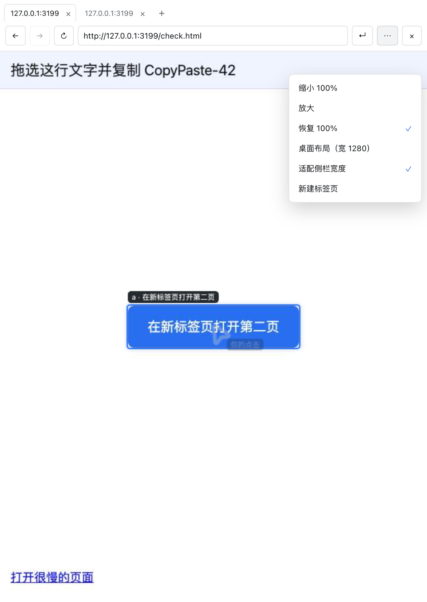

# DSH Browser Plugin

`dsh-plugin-browser` provides a Session-isolated Chromium browser for the DeepSeek Harness Web app, with the same page rendered in the right Sidebar:

- The `browser` tool runs Playwright Chromium in a Session-scoped context for automation, accessibility snapshots, and screenshots.
- The `Browser` page in the Web right Sidebar uses the official Sidebar extension API to stream that same page live and forward pointer, keyboard, navigation, and scroll input.
- The pane is organized like a real browser: a tab strip, Back and Forward, Stop, an address bar, a tools menu, and a context menu, with tab count and load state following the Agent's actions.
- The same page moves between the Sidebar tab and a whole-window panel in the main area through the toolbar's window group, which offers `Open in the main area` and `Return to the Sidebar`; both surfaces share tabs, the visit log, and the picture, while each keeps its own zoom and layout choice.
- Focusing the address field opens `Visited pages`, listing the pages this Session has visited, newest first; a row returns to that page, and an empty log shows a placeholder.
- The stream carries operation cues: Agent actions leave a mouse pointer with a caption, hovering outlines the element with its role and name, a focused field shows an outline and caret, and typed text echoes briefly.
- Layout switches between a desktop viewport and the Sidebar width, with zoom steps. Click, drag, scroll, double-click to select, paste, use an IME, and press Tab, arrows, or paging keys directly on the frame.

The tool and Sidebar share cookies, storage, login state, and page history. Host automation remains headless by default while the Sidebar provides the visible surface. Enter passwords and MFA codes manually in the Sidebar; the tool never exports credentials.

## Feature screenshot


Figure: validation capture of a local fixture page inside the DSH Web right Sidebar, showing the focus outline, element caption, typed-text echo, and mouse pointer; see [`docs/screenshots/SOURCES.md`](docs/screenshots/SOURCES.md) for provenance and validation boundaries.



Figure: the same pane with its tab strip, Back and Forward state, address bar, and the tools menu carrying the zoom steps and the `Fit Sidebar width` option.

## Install

Node.js 22.19 or later and Chromium runtime dependencies are required. Use the same `DSH_HOME` when installing and starting Harness.

```sh
git clone https://github.com/hzxwonder-dsh-plugins/dsh-plugin-browser.git
cd dsh-plugin-browser
npm ci
npm run browser:install
dsh plugin --profile migration add "file:$PWD"
```

Keep the `file:` prefix so pnpm installs the package's declared dependencies. A
bare path is treated as `link:` and only links the plugin directory.

Restart Harness after changing the plugin configuration. Host automation is headless by default; an existing Chrome binary can be selected:

```yaml
- id: dsh-plugin-browser
  config:
    executablePath: /Applications/Google Chrome.app/Contents/MacOS/Google Chrome
    headless: true
```

Keep `headless: true` and use `Browser` in the right Sidebar for inspection or manual password/MFA entry. Each Session receives an ephemeral BrowserContext, with at most eight Sessions at once. Login state is cleared by `close` or Harness shutdown.

`allowedOrigins` limits the sites the browser may reach; an omitted or empty list leaves every origin reachable:

```yaml
- id: dsh-plugin-browser
  config:
    allowedOrigins:
      - https://example.com
      - https://intranet.example.com:8443
```

Entries match the normalized origin exactly (scheme, host, and port; a path or query is ignored), and an entry that is not an HTTP(S) address — or a value that is not a list — fails at plugin load.

## Right Sidebar browser

After the Web client extension is installed, the right Sidebar registers a `Browser` page:

1. Open the Harness Web right Sidebar and select `Browser`. A tool navigation opens it automatically.
2. Enter an HTTP(S) address in the address bar and press Enter; a tool navigation drives the same page. Focusing the address field opens `Visited pages`, newest first; a row returns to a page this Session has visited, and an empty log shows a placeholder.
3. The toolbar is grouped into navigation, address, view, and window: Back, Forward, and Reload or Stop in the navigation group; the address field with its Enter `Go` in the address group; the `⋯` tools menu with the `Compatibility view` note in the view group; and the move between the two surfaces with `Close browser` in the window group. The error row is its own line with a `×` to dismiss it.
4. `Open in the main area` in the window group lays the same page out as a panel in the main area, and `Return to the Sidebar` on that panel puts it back into the Sidebar tab: both surfaces are the same page of one Session and share tabs, the visit log, and the picture, while each keeps its own zoom and layout choice.
5. Manage pages in the tab strip: `+` opens a tab, a tab click switches, and `×` closes. A window the site opens becomes a managed tab instead of being lost; a Session holds at most 12 tabs, so `+` is refused at that limit and a page the site opens past it is closed.
6. Back and Forward enable or disable from the active tab's history; while a page loads the reload button becomes Stop, which ends a slow load. Click the frame to operate the page: the clicked point shows a ripple and pointer, and a focused field shows its outline and caret.
7. Typing reaches the focused element; paste, drag, and scroll work the same way. `Ctrl/Cmd+C` copies the page selection into the system clipboard, and the context menu offers Copy, Paste, and Select All. While the Agent acts, the frame shows where it clicked or typed and labels the operation.
8. The `⋯` menu switches between `Desktop layout (1280 wide)` and `Fit Sidebar width` and offers Zoom In, Zoom Out, and Reset to 100%. Desktop layout keeps the page as a wide screen renders it; fitting the Sidebar uses the Sidebar width as the page width, which suits reading in a narrow pane.

The page accepts credential-free HTTP(S) addresses and streams Chromium through the authenticated Host interface, including sites that deny iframe embedding; the Sidebar tab and the main-area panel are the same page, and only the visible one requests frames. Frames arrive as CDP events, so a still page costs no traffic and actions update immediately; a two-second heartbeat reports whether frames are still produced, and the pane marks the picture paused once they stop. When the stream is unavailable the pane falls back to one-shot captures, marks the toolbar `Compatibility view`, and keeps retrying. Human input is stored as a fraction of the picture, so a layout or zoom change never moves a click elsewhere. User input invalidates the tool observation; take another snapshot before tool input. Audio/video streaming, downloads, and credential export are unavailable.

## The `browser` tool

Supported actions are `navigate`, `snapshot`, `screenshot`, `click`, `fill`, `press`, `scroll`, `tabs`, `console`, `evaluate`, and `close`. `tabs` takes an `op` of `list`, `new`, `select`, or `close` plus a `tab` id; `list` is a pure read, while switching or closing a tab invalidates the older observation.

Navigate or take a snapshot first, then pass the latest `observation` plus the exact accessible `role` and `name` to an input action. Re-observe after a page change. A purely visual target with no accessible name can be clicked at its observed coordinates:

```json
{"action":"click","x":420,"y":180,"observation":5}
```

`press` forwards a fixed key set (Enter, Tab, Shift+Tab, Esc, Backspace, Delete, Insert, arrows, Home, End, PageUp, PageDown, F5, and Ctrl/Cmd combinations); use `fill` for printable text. `evaluate` accepts only fixed inspections: `title`, `visible_text`, `links`, and `layout`; it does not run arbitrary JavaScript.

Example:

```json
{"action":"navigate","url":"http://127.0.0.1:3000"}
```

```json
{"action":"snapshot"}
```

```json
{"action":"fill","role":"textbox","name":"Project name","text":"demo","observation":3}
```

`screenshot` returns a Harness attachment and masks password and one-time-code fields. Output receives limited redaction for token, cookie, and authorization fields; this is not a complete data-loss-prevention system.

## Authority and data boundaries

- Navigation is limited to HTTP(S), including localhost; `file:`, `data:`, `javascript:`, and credential-bearing URLs are rejected.
- With `allowedOrigins` configured, only top-level navigation to a listed origin is admitted: `navigate` fails with `BROWSER_ORIGIN_DENIED`, and a site-driven redirect or script is caught when it commits and sent back to a blank page, while sub-resources keep the HTTP(S) scheme policy.
- A `read-only` sandbox permits observation but rejects `click`, `fill`, and `press`; hover cues and reading the visit log stay available.
- Passwords and MFA codes are entered manually by the user in a visible browser; the plugin has no credential-export action.
- Page text, URLs, console output, and screenshots can contain private data and enter Session records or model context. Treat page content as untrusted task data.
- The visit log lives in memory per Session, records HTTP(S) pages only, is deduplicated by URL with the newest first, and holds at most 256 records.
- Downloads, Service Workers, arbitrary script execution, and cross-Session reuse are not exposed. Permission requests from a page are refused.
- A Session holds at most 12 tabs: an explicit new tab past that limit fails with `BROWSER_TAB_LIMIT` instead of evicting an open tab, and a page the site opens past it is closed.

The browser process uses the host's network authority. A signed-in click can change an external system, so confirm the target and authorization before acting.

## Verify

```sh
npm test
# Optional: use an existing Chrome binary
BROWSER_TEST_EXECUTABLE=/path/to/chrome npm test
```

The tests start a local HTTP fixture and cover navigation, form input, stale-observation rejection, console output, screenshots, fixed inspections, Session isolation, and the Sidebar stream with its frame, pointer, focus, drag, and coordinate-click events. The same suite covers opening, switching, and closing tabs, a site popup becoming a tab, history state for Back and Forward, stopping a slow load, and reading the page selection. Normalizing and enforcing `allowedOrigins`, recording the visit log with its deduplication and bound, and the tab limit with an over-limit popup are covered as well. Harness Web Sidebar activation and native attachment rendering are separate integration checks; see [`docs/e2e.md`](docs/e2e.md).

## Development docs

- [`docs/spec.md`](docs/spec.md): tool and right-Sidebar page contract.
- [`docs/e2e.md`](docs/e2e.md): browser-engine and Web integration scenarios.
- [`README.md`](README.md): 中文主文档。

## License and provenance

LGPL-3.0-only. The implementation uses the official DeepSeek Harness client extension APIs and follows the PI-Desktop browser interaction contract. Attribution is recorded in [`NOTICE`](NOTICE); dependencies retain their own licenses.
